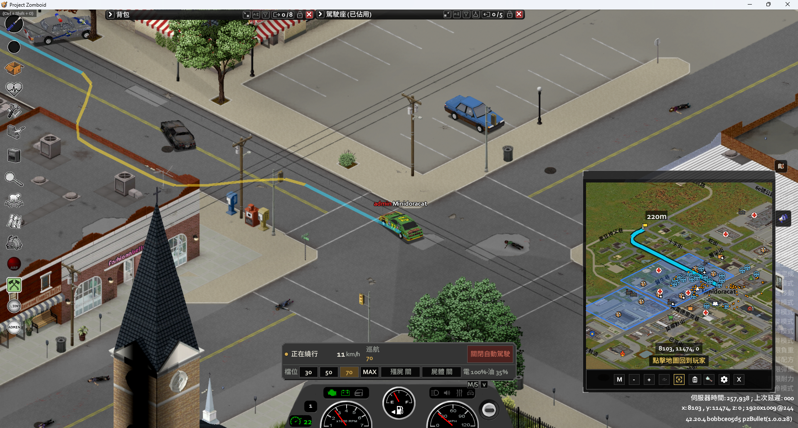
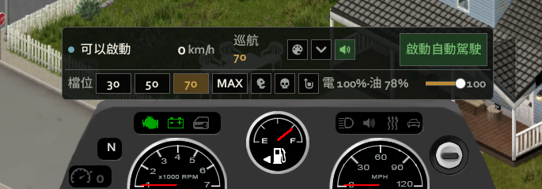
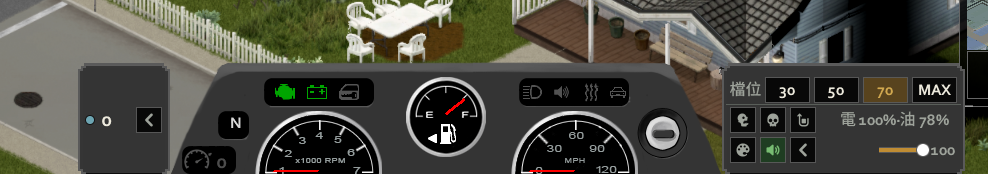
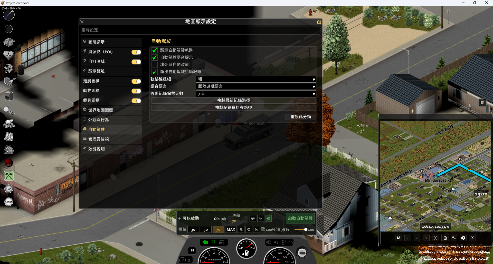

# Minidoracat MiniMap - AutoDrive for B42

道具驅動的車輛導航與自動駕駛：GPS 導航儀規劃路線，自駕模組沿路網自動行駛

Project Zomboid Build 42 MOD。

## 目前功能

- 兩件分級道具：GPS 導航儀與自動駕駛模組，可從電子／軍用物資取得或以電子技能合成；兩件道具的「允許合成」與「世界搜刮生成」各有獨立沙盒開關
- 電子導航維修手冊：閱讀一本即可學會 GPS 與自駕模組兩份配方；實際製作仍需電工 3／6 級。手冊只會出現在尚未生成戰利品的電子、電腦書籍、圖書館與雜誌容器，既有容器不會回填
- 三條學習路徑互補：GPS 可在電工 3 級研究自身配方；自駕模組可在電工 3 級研究 GPS、電工 6 級再研究自駕配方，且研究不消耗成品；電工 6／8 級則自動學會。多人既有高技能角色登入時由伺服器補學
- GPS 導航需求可由沙盒開關；缺少帶電導航儀時，主 MOD 的導航路線與目標會被鎖定並顯示提示
- 使用螺絲起子在車輛電瓶艙安裝／卸載裝置；單人與多人共用伺服器權威驗證
- 安裝狀態隨車保存；GPS 卸下時保留原有電量
- 車輛 radial 選單可啟停自駕；導航 API v4 的 20–90° 可行折點會在道路寬度內轉成平滑圓角（底層圓弧相切，行駛折線以最長 1 公尺、切線誤差不超過 2° 取樣；塞不進路面帶時保留折點爬行）。前方彎道只以 coast 包絡預降，正常彎道不以完整煞停代替減速
- 駕駛 HUD 與原版車輛儀表可見邊緣融合，金屬主題沿用原版 #343434 面板與斜角樣式；顯示狀態、車速、巡航上限、檔位、減速政策與電油量，可直接啟停與切檔。滑鼠停在殭屍／屍體政策上會顯示判定範圍、分級限速、非障礙物行為與伺服器鎖定狀態；原版儀表內建收放鈕與 M/S 主題切換鈕，另有簡約／精簡／收合模式。HUD 使用與原版儀表相同的一般 UI 層，設定與管理視窗會正常顯示在其上方
- **速度檔位與瘋狂模式**：HUD 可切換 30／50／70 km/h 與「瘋狂（車輛極速）」四檔。解除額外限制需同時通過感知就緒與新鮮、煞停距已載入、走廊與車身掃掠、跟線狀態、回線完成、連續對正、進度健康、圓角與路面帶證明；近場安全證明缺失時不超過 15 km/h，回線／進度／圓角／路面帶失敗時不高於 70 km/h，對正失敗則按誤差比例降速
- 可從 ESC 的 MOD Options 或支援 client-settings API v1 的 MiniMap 齒輪「自動駕駛」分類開關，並選擇 1／3／7 像素的細／標準／粗單線；三檔每段都只呼叫一次 client renderer，粗線只增加少量客戶端像素填充，完全不使用伺服器資源。舊版 MiniMap 不顯示齒輪分類，ESC 選項仍可用。紅色障礙圈、路面帶等診斷標記仍只在 DebugOverlay 顯示
- **開發用診斷紀錄（預設關閉）**：可在 MOD Options／新版 MiniMap「自動駕駛」分類選擇匯出本機診斷紀錄，設定從下一段自駕生效。紀錄只寫在這台電腦，含絕對世界座標（x/y）、原始 epoch 毫秒時間戳（不做時區轉換），以及開啟時的引擎／煞車／輪胎與路況物理狀態；採固定 64 個紀錄槽、每槽最多 2MiB；開始新紀錄時會清空過期槽重用，檔名仍保留（預設保留 7 天，可選 1／3／7／14／30 天）。單槽寫滿後該段停止追加，不覆蓋檔案開頭。每段仍各用一個 `session-NNN.log`，`session-index.txt` 記錄 start／end／檔名／大小／結束原因。複製路徑成功時優先顯示家族共用 Toast，舊版框架或 Toast 失敗則改用頭上提示；MiniMap API v1 仍可改開關與保留天數，但不顯示複製按鈕；更舊版仍可用 ESC 選項
- **靠右行駛**：沿路線右車道行駛（偏移量沙盒可調 0-2 公尺，0＝關閉），會車時雙方自然錯開；繞行時從右車道平滑切換到繞行線再回來
- 轉向採側向橫推車尾的衝量模型（量級隨車重與車速縮放），過彎帶輕微甩尾屬正常特性；原地調頭改用力偶模式，緩慢平穩迴轉不橫滑
- 玩家碰方向盤、油門或煞車時立即讓位；放手後 2 秒無輸入才恢復自駕並顯示提示，恢復時高速大誤差先煞車再調頭，不與玩家搶控制
- 自駕以單一 2.5 秒進度監督取代舊的低速／高速兩套卡住判定：車體世界位移、沿線前進或原地轉向任一有進度就重臂；高檔空轉會先短暫關閉定速器讓變速箱回低檔，仍無進度才在確認後方 4 公尺淨空後倒車。倒車期間每 100ms 重查後方，未知區域、牆或車輛都會立即停止，不盲退
- 車輛 script 若缺少可信的車身尺寸或重心資料，會拒絕啟動並明確提示，而不是套用猜測尺寸繼續控制
- 走廊感知：沿路線前方 48 公尺（沙盒上限 >85 時自動拉長到 110 公尺）逐格掃描障礙；車輛用格級幾何查詢（不受 MP 同步抖動影響），同一台車連兩輪不動即視為障礙。路面置中會拒絕寬逾 10 公尺或被掃描邊界截斷的連片鋪面，避免停車場或路口把行駛線拉出街道；導航路線換向時也會先清除舊方向的校正
- 繞行：以同一條世界座標折線規劃、掃掠、跟隨與繪圖；entry／exit 長度依車速、側移量、橫向加速度與 jerk 動態延長，空間不足會反解降速。寬裕靜態障礙可自然高於 28 km/h，停駛／行進車輛與窄縫仍維持低速
- 堵死處理鏈：目前車身碰撞守門或規劃堵死先煞停；脫困前檢查後方，成功倒退 3 公尺後先煞到低於 1 km/h 才重新掃描並前進。失敗縫的 episode ban 會跨同目標改道保留，前進至少 10 公尺且連續兩輪車身淨空後才解除；相同目標最多嘗試三次，改真正目的地才立即重置
- 終點、彎道與未載入區域使用同一套車型／路況包絡；可視距離以二次式正根反解速度，速度命令再以 jerk 上限平滑。正常彎道與直線超速以 coast／jerk 收油；完整煞停保留給碰撞、堵住、抵達、不安全回線、脫困、無效動態狀態、高速調頭，以及當段圓角或可視距離硬包絡被突破
- 殭屍／屍體減速各有三態政策。兩者只計前方 2–48 公尺（高速檔 110）、行駛線左右各 3 公尺：殭屍 1–3／4–7／8+ 隻分別限 25／15／10 km/h，任一屍體限 20 km/h；兩者都不是障礙物，不會觸發繞行或停車。關閉只取消該項專屬限速，其他安全限制仍有效
- GPS 與自駕各有獨立電量／燃油倍率（0–500%），同時使用時相加。電量負載與原版發電機充電並存；現行倍率範圍內，引擎正常運轉時電瓶仍淨充電，倍率反映在回充速度（熄火 GPS 則直接放電）。燃油 100% 時，GPS 導航中的車輛在原生實際油耗上加 5%、自駕加 25%（同時啟用共加 30%）。隨身 GPS 的電量只扣自身電池，但用它導航行駛時仍套用 GPS 油耗加成
- 目前已發布版本為 0.3.0：語音提示、四種 HUD 主題（含側掛雙翼）、堵死時的「改道」鈕與自動改道選項、多人伺服器速限下的定速修正、路口圓角與車道偏置修正

## 截圖

| 自動駕駛 HUD＋導航路線 | 路口跟線＋小地圖同步 |
|---|---|
|  |  |
| 沙盒設定 | GPS／自動駕駛道具 |
|  |  |
| HUD 主題：金屬擬物 | HUD 主題：簡約玻璃 |
|  |  |
| HUD 主題：家族卡片 | HUD 主題：側掛雙翼 |
|  |  |
| MiniMap 設定「自動駕駛」分類 | |
|  | |

## 安裝

- Steam Workshop：[Minidoracat MiniMap - AutoDrive for B42](https://steamcommunity.com/sharedfiles/filedetails/?id=3792675881)
- 手動安裝：把 `MOD/MinidoracatAutoDriveFor42/Contents/mods/MinidoracatAutoDriveFor42` 複製到 `%USERPROFILE%\Zomboid\mods\` 並將資料夾改名為 `MinidoracatAutoDriveFor42`

本 addon 需要 [Minidoracat MiniMap for B42](https://steamcommunity.com/sharedfiles/filedetails/?id=3763913359)
與 Minidoracat UI for B42；不與 Navigator 共存（兩者都佔用車輛儀表上方）。

## 回報導航問題

自動駕駛走錯路、卡住、無故停下或交還操控，請開 GitHub Issue（New issue → 「導航問題回報」），表單會逐欄要求資料。關鍵是**整個 `Telemetry` 資料夾的 zip**——靠 `session-index.txt` 的時間戳與各段紀錄才定位得到出問題的那一段：

1. ESC → MOD 選項（或 MiniMap 齒輪 → 「自動駕駛」）勾選「匯出自動駕駛診斷紀錄」（預設關，下一段自動駕駛生效）
2. 重現問題
3. 同一頁按「複製紀錄資料夾路徑」→ 檔案總管網址列貼上 → Enter
4. 對 `Telemetry` 資料夾右鍵 → 壓縮成 ZIP（整個資料夾）
5. 把 zip 拖進表單的附件欄；只附 zip，不要貼路徑（含你的電腦帳號名稱）

紀錄含遊戲內絕對座標、原始 epoch 毫秒時間戳與啟用的 MOD 清單，沒有帳號／Steam ID／IP／伺服器名稱；公開 repo 的附件任何人都能下載，請自行斟酌。zip 超過 25 MB 時只附 `session-index.txt`、`latest.txt`、`manifest.txt` 與最後幾段 `session-NNN.log`。

English: open a GitHub issue with the "Navigation problem report" form and attach the whole `Telemetry` folder as a zip — the form lists the steps.

## 開發
- `link_workshop.bat`：把 repo 掛載到 `Zomboid\Workshop\` 與 `Zomboid\mods\`（符號連結，repo 改動即時生效）
- `PZ_Test.bat`：啟動測試（客戶端 / 專用伺服器 / 多客戶端組合）
- 診斷紀錄（需先在選項開啟）：本機 `Lua/MinidoracatAutoDrive/Telemetry`，每段自駕一個 `session-NNN.log`；管理檔為 `manifest.txt`、`latest.txt`、`session-index.txt`。後者固定最多 64 列，以 raw epoch ms 對應每段檔案；MiniMap v2 可複製最新檔或資料夾絕對路徑

## 版本

版本號格式：`{PZ 版本}-{mod 版本}`（例 `42.20.4-0.1.0`），詳見 [CHANGELOG.md](CHANGELOG.md)。

## 作者

Minidoracat — [Discord](https://discord.gg/Gur2V67) | [Twitch](https://www.twitch.tv/minidoracat)
